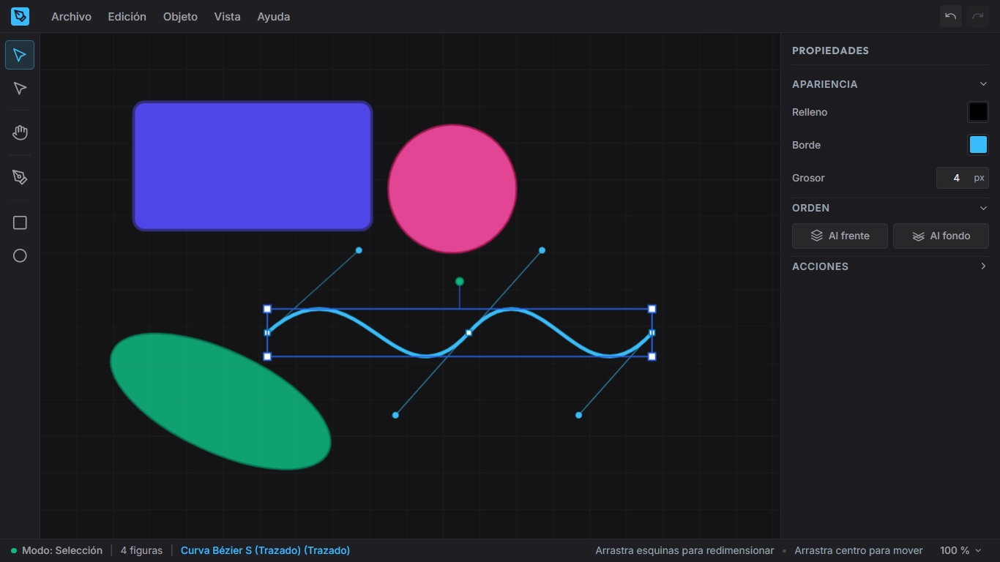

# Vector Editor

Editor gráfico vectorial 2D interactivo desarrollado en TypeScript sobre Canvas 2D nativo.



El proyecto está diseñado bajo una arquitectura modular, predecible y extensible. Implementa un **Scene Graph inmutable** con compartición estructural (*structural sharing*), renderizado reactivo optimizado mediante bucle de repintado controlado (*dirty loop*), transformaciones geométricas continuas con soporte para marcos locales rotados, manipulación directa de curvas Bézier y un sistema completo de historial Deshacer / Rehacer basado en el patrón Command.

---

## Arquitectura y Principios de Diseño

El núcleo del editor se apoya en cuatro pilares fundamentales:

1. **Inmutabilidad Estricta**: El árbol de escena (`Document > Layer > Shape`) nunca se muta directamente. Cada mutación produce una nueva referencia inmutable mediante persistencia estructural (`StateManager`), garantizando un flujo unidireccional predecible y eliminando efectos secundarios.
2. **Renderizado Reactivo por Dirty Loop**: El ciclo de dibujado (`RenderEngine`) se sincroniza con `requestAnimationFrame` y únicamente procesa el lienzo cuando el flag `isDirty` del estado se encuentra activo, maximizando el rendimiento y eliminando ciclos de CPU innecesarios.
3. **Historial Desacoplado (Command Pattern)**: Toda interacción del usuario se modela como un objeto `Command`. Las operaciones compuestas se encapsulan en `BatchCommand` para mantener un historial atómico (un único paso de deshacer), y las transformaciones continuas se fusionan temporalmente (`mergeWith`) para consolidar micro-movimientos.
4. **Desacoplamiento Canvas / DOM**: El motor de renderizado y el controlador de entrada interactúan exclusivamente con el estado geométrico y espacial. La interfaz HTML se suscribe reactivamente a través de un bus de observabilidad (`setupUIBindings`).

---

## Capacidades del Sistema

### Motor Gráfico y Scene Graph
- **Estructura Jerárquica**: Documento raíz, capas independientes y figuras primitivas (`Rectangle`, `Ellipse`, `Path`).
- **Transformaciones Geométricas**:
  - Traslación, redimensionado con tiradores proyectados al ángulo local de rotación y rotación centrada en el centroide de la figura.
  - Restricción de proporciones 1:1 al redimensionar o crear figuras manteniendo pulsada la tecla `Shift`.
- **Detección Geométrica (Hit Testing)**:
  - Evaluación en dos fases: descarte rápido mediante cajas delimitadoras alineadas al eje (AABB) y resolución precisa mediante cajas delimitadoras orientadas (OBB).
  - Transformación inversa de coordenadas locales para geometrías rotadas e interpolación de distancias a segmentos Bézier.

### Herramientas de Creación y Edición
- **Selección (`V`)**: Selección individual y múltiple, arrastre grupal de figuras y manipulación de tiradores de transformación.
- **Selección Directa (`A`)**: Inspección y arrastre individual de puntos de ancla y manejadores de control tangenciales en curvas Bézier.
- **Pluma Bézier (`P`)**: Trazado interactivo de curvas cúbicas y segmentos rectos mediante clics y arrastres de tangentes, con previsualización elástica y cierre automático de trazados.
- **Rectángulo (`R`)** y **Elipse (`E`)**: Creación fluida con previsualización en tiempo real y restricción de aspecto simétrico con `Shift`.
- **Mano (`H`)**: Desplazamiento panorámico (*pan*) sobre el lienzo infinito (también accesible manteniendo pulsada la barra espaciadora en cualquier herramienta).

### Selección Múltiple y Operaciones Grupales
- **Selección por Marquesina**: Arrastre de un rectángulo de selección en el fondo del lienzo para envolver o intersectar figuras en vivo.
- **Selección Acumulativa**: Incorporación o deselección individual mediante `Shift + Clic`, y selección global del documento mediante `Ctrl + A`.
- **Operaciones Atómicas en BatchCommand**:
  - **Eliminación (`Supr` / `Backspace`)**: Borrado grupal y restauración exacta en sus capas e índices originales al deshacer.
  - **Copia y Pegado (`Ctrl+C` / `Ctrl+V`)**: Portapapeles múltiple que genera réplicas conservando posiciones y orden de apilado relativo, aplicando desplazamientos acumulativos sucesivos (+10 px por pegado).
  - **Duplicación (`Ctrl+D`)**: Copia inmediata posicionada sobre la figura más alta de cada capa contenedora.
  - **Reordenamiento**: Traer al frente (`Ctrl+Shift+]`) y enviar al fondo (`Ctrl+Shift+[`) preservando el orden relativo de apilado entre las figuras seleccionadas.
  - **Desplazamiento por Teclado**: Flechas de dirección para ajustes finos (1 px) o acelerados con `Shift` (10 px), con consolidación automática de pulsaciones rápidas en una sola entrada de historial.

### Historial de Comandos (Undo / Redo)
- Implementación completa de `execute()`, `undo()` y `redo()`.
- Soporte para transacciones compuestas mediante `BatchCommand` con ejecución directa e inversión simétrica al deshacer.
- Fusión inteligente de eventos (`mergeWith`): arrastres de ratón, edición interactiva y pulsaciones continuas de teclado se consolidan automáticamente.

### Viewport y Navegación Espacial
- **Zoom Continuo Centrado**: Rango operativo del 10 % al 3200 %, fijando invariante el punto del mundo situado bajo el cursor del ratón.
- **Atajos y Ajustes de Vista**: Zoom rápido con rueda (`Ctrl + Rueda`), centrado de escena a la ventana (`Ctrl + 0`) y escala natural 1:1 (`Ctrl + 1`).

### Interfaz de Usuario y Persistencia
- **Panel de Propiedades Reactivo**: Edición sincronizada de color de relleno, trazo y grosor para una o múltiples figuras seleccionadas simultáneamente.
- **Barra de Menús y Estado**: Menús desplegables accesibles vinculados al estado del documento, e indicadores en vivo de zoom, herramienta activa y conteo de selección.
- **Serialización JSON Robusta**: Validación estructural estricta con reporte detallado de rutas en caso de error (`DocumentParseError`), y descarga/importación de archivos de proyecto `.json`.

---

## Estructura del Proyecto

```text
vector-editor/
├── src/
│   ├── types/         # Definiciones TypeScript del Scene Graph (Document, Layer, Shape, PathPoint)
│   ├── state/         # StateManager inmutable (structural sharing) y Serializer JSON
│   ├── commands/      # CommandManager, BatchCommand e implementaciones del Command Pattern
│   ├── render/        # RenderEngine (Canvas 2D, optimización isDirty, overlay OBB)
│   ├── input/         # InputController (despacho de herramientas, eventos DOM, hit testing)
│   ├── viewport/      # ViewportManager y proyecciones espaciales (zoom, pan, coordenadas)
│   ├── utils/         # Utilidades puras (geometría, transformaciones, inmutabilidad)
│   ├── main.ts        # Bootstrap de la aplicación y enlace reactivo con la UI (setupUIBindings)
│   └── index.ts       # Punto de entrada público de la biblioteca
├── test/              # Suites de pruebas unitarias ejecutadas con node:test
├── index.html         # Maqueta HTML5 y diseño de interfaz
├── tsconfig.json      # Configuración TypeScript estricta ("strict": true)
└── package.json       # Configuración del paquete y scripts de compilación
```

---

## Instalación y Ejecución

### Requisitos del Sistema
- **Node.js**: Versión 22.0 o superior (con soporte para `--experimental-strip-types`).
- **npm**: Versión 10.0 o superior.

### Comandos de Terminal

1. **Instalación de dependencias**:
   ```bash
   npm install
   ```

2. **Entorno de desarrollo local**:
   ```bash
   npm run dev
   ```
   Inicia el servidor Vite en `http://localhost:5173`.

3. **Ejecución de la suite de pruebas unitarias**:
   ```bash
   npm test
   ```
   Ejecuta las pruebas unitarias nativas con `node:test` y verificación estricta de tipos.

4. **Compilación para producción**:
   ```bash
   npm run build
   ```
   Ejecuta el chequeo estático con `tsc` y genera el bundle optimizado en `dist/`.

---

## Referencia de Atajos de Teclado

| Contexto | Atajo | Acción |
| :--- | :--- | :--- |
| **Herramientas** | `V` | Herramienta Selección |
| | `A` | Herramienta Selección Directa (vértices Bézier) |
| | `P` | Herramienta Pluma (curvas Bézier) |
| | `R` | Herramienta Rectángulo |
| | `E` | Herramienta Elipse |
| | `H` | Herramienta Mano (Pan) |
| **Selección** | `Ctrl + A` | Seleccionar todas las figuras |
| | `Shift + Clic` | Añadir o remover figura de la selección |
| | Arrastre en fondo | Selección por marquesina rectangular |
| **Edición** | `Ctrl + Z` | Deshacer última acción |
| | `Ctrl + Shift + Z` / `Ctrl + Y` | Rehacer última acción |
| | `Ctrl + C` | Copiar figuras seleccionadas |
| | `Ctrl + V` | Pegar figuras del portapapeles |
| | `Ctrl + D` | Duplicar figuras seleccionadas |
| | `Supr` / `Backspace` | Eliminar figuras seleccionadas |
| **Disposición** | `Ctrl + Shift + ]` | Traer figuras al frente |
| | `Ctrl + Shift + [` | Enviar figuras al fondo |
| **Navegación** | `Ctrl + +` / `Ctrl + -` | Aumentar / Reducir zoom |
| | `Ctrl + 0` | Ajustar área visible al lienzo |
| | `Ctrl + 1` | Zoom al 100 % (escala real) |
| | `Espacio + Arrastre` | Desplazar el lienzo (*Pan*) |
| **Transformación** | `Flechas` | Mover selección 1 px |
| | `Shift + Flechas` | Mover selección 10 px |

---

## Cobertura y Calidad de Pruebas

El repositorio mantiene una suite de pruebas automatizadas con más de 275 tests unitarios que cubren:

- **Integridad del Scene Graph**: Garantía de inmutabilidad (`Object.freeze`), persistencia estructural y aislamiento de la selección fuera del árbol del documento.
- **Historial y Comandos**: Validación de operaciones unitarias y lotes compuestos (`BatchCommand`) con 1, 2 y 3 figuras en ciclos de Undo/Redo.
- **Precisión Matemática**: Cálculos de cajas OBB, proyección de deltas rotados y curvas de Bézier cúbicas.
- **Sincronización de UI**: Integración y reactividad del panel de propiedades, la barra de estado y los menús ante variaciones de selección y carga de archivos.

---

## Hoja de Ruta (Roadmap)

El diseño modular del editor permite una evolución continua y estructurada. Las áreas de desarrollo planificadas abarcan:

### 1. Primitivas y Trazados Avanzados
- Inclusión de nuevas primitivas vectoriales: polígonos regulares, estrellas paramétricas y segmentos de línea simple.
- Cajas de texto enriquecido con control tipográfico vectorial.
- Operaciones booleanas de trazados basados en curvas Bézier (unión, intersección, diferencia y exclusión).

### 2. Jerarquía de Escena y Organización
- Soporte para grupos jerárquicos de figuras (`GroupNode`) con soporte para transformaciones compuestas anidadas.
- Panel dedicado de capas con reordenamiento por arrastre (*drag and drop*), bloqueo y ocultación visual.

### 3. Estilos y Apariencia
- Rellenos avanzados: degradados lineales y radiales con múltiples paradas de color.
- Efectos de capa: sombras paralelas arrojadas, desenfoque gaussiano y modos de mezcla (*blend modes*).

### 4. Asistencia y Precisión Geométrica
- Guías de alineación magnética inteligentes (*smart guides*) con detección de centros y bordes.
- Cuadrícula métrica configurable con atracción de coordenadas (*grid snapping*).
- Herramientas de alineación y distribución espacial uniforme.

### 5. Interoperabilidad y Exportación
- Exportador a estándar SVG compatible con navegadores y editores vectoriales externos.
- Generador de exportación rasterizada en formatos PNG y WebP con selección de resolución (1x, 2x, 3x).

---

## Licencia

Este proyecto está distribuido bajo la licencia MIT.
